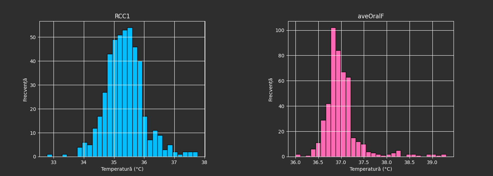
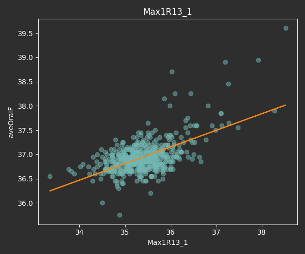
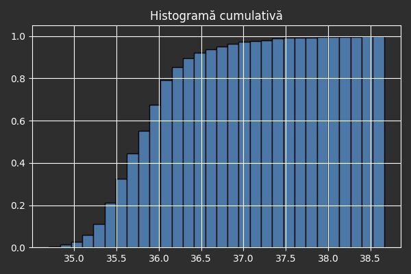
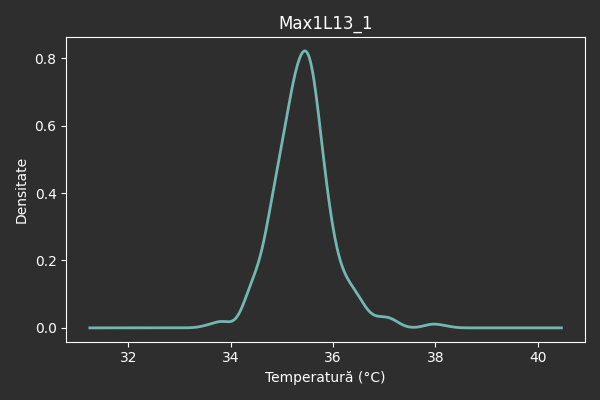

# 📊 Analiză Temperatură Facială vs. Orală

Această aplicație web (realizată cu Flask) permite:
- Încărcarea unui fișier `.csv` cu temperaturi
- Afișarea de histograme comparative între o coloană aleasă și o temperatură de referință
- Calculul regresiei liniare și coeficientului de corelație Pearson
- Generarea histogramei cumulative și a densității de probabilitate (KDE)

---

## ▶️ Cum rulezi aplicația local

### 1. Clonează repository-ul

```bash
git clone https://github.com/utilizatorul-tau/analiza_temperaturi.git
cd analiza_temperaturi
```
2. Creează un mediu virtual (opțional, dar recomandat)  
```bash
python -m venv venv
venv\Scripts\activate  # pe Windows
# sau
source venv/bin/activate  # pe Linux/macOS
```
3. Instalează dependențele
```bash
pip install -r requirements.txt
```
4. Rulează aplicația
```bash
python analiza_flir.py
```
5. Deschide aplicația în browser
Accesează:
http://127.0.0.1:5000/

🗂 Structura fișierelor
```bash
analiza_temperaturi/
├── app.py
├── requirements.txt
├── templates/
│   └── index.html
├── static/
│   └── *.png (generate automat pentru grafice)
├── uploads/
│   └── fișiere CSV încărcate de utilizator
├── README.md
└── .gitignore
```

🧪 Formatul fișierului CSV
CSV-ul tău trebuie să:

Conțină un header la linia 3 (primele 2 rânduri sunt ignorate)

Aibă coloane numerice relevante (ex: faceTemp, aveOralF, aveOralM)

Evite coloanele Unnamed

## 📸 Capturi

### Histogramă comparativă


### Regresie liniară


### Histogramă cumulativă


### Densitate de probabilitate (KDE)


📜 Licență
Licențiat sub Licența MIT.
Poți folosi, modifica și distribui liber codul, fără garanții sau responsabilitate.

🙌 Autori
Creat cu ❤️ de:

Enache Victor

Voicu Cătălin

Simte-te liber să clonezi, îmbunătățești sau distribui proiectul!